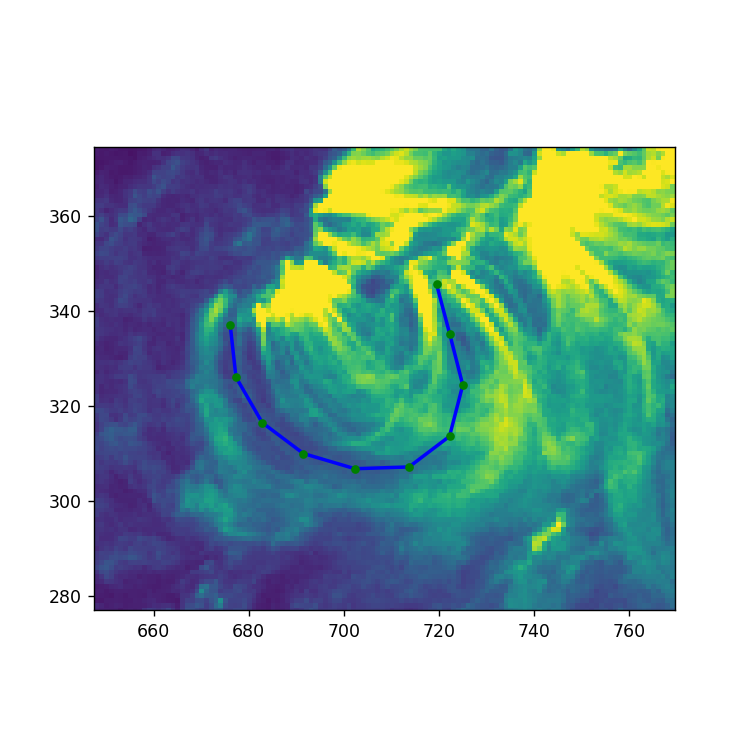
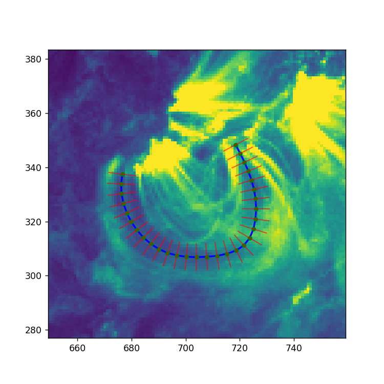

# Руководство по работе с инструментом по анализу солнечных изображений

## Введение

Привет, пользователь! Этот гайд содержит в себе все необходимые инструкции для работы с используемым ПО.

Представленный инструмент - это интерактивный Matplot-виджет, реализованный в Jupyter Notebook, позволяющий строить интерполяционные кривые вдоль корональных петель на Солнце. Построение сплайнов производится на самих солнечных AIA-изображениях, которые, в свою очередь, могут быть загружены по интересующей Вас дате и времени, либо могут быть загружены из готового датасета. 

## Инструкция по установке
Данное ПО реализовано на: 
* **Windows**
* **Python 3.11.9**
* **VS code**

#### Шаг 1. Клонирование репозитория
```bash
git clone https://github.com/SunImagesTDPB/MerdeevSunProject.git
```

#### Шаг 2. Установка необходимых библиотек
Производится в терминале Вашей IDE.
```bash
pip install -r requirements.txt
```

#### Шаг 3. 
В интерфейсе Jupyter откройте файл `[widget.ipynb]`.

#### Шаг 4.
Следуйте инструкциям внутри блокнота.

#### Ключевые моменты
* Запуск калькулятора для конвертации должен проводиться отдельно от запуска основных исполняемых ячеек. Вычислил - закрыл.
* Matplot-виджет имеет внутренний интерфейс, а именно:
   1) Приближение выделенной области
   2) Возвращение к исходному формату снимка
   3) Экспорт изображений
* Добавление точек интерполяции, помимо ручного ввода, также производится двойным нажатием на ЛКМ.


## Примеры работы инструмента

Ниже представленны изображения (канал 171 AIA), полученные в результате выполнения **Уровня 1** и **Уровня 2** программы соответственно.



*Пример 1: Интерполяционный сплайн, построенный вдоль корональной петли*




*Пример 2: Область, построенная по точкам сплайна*
